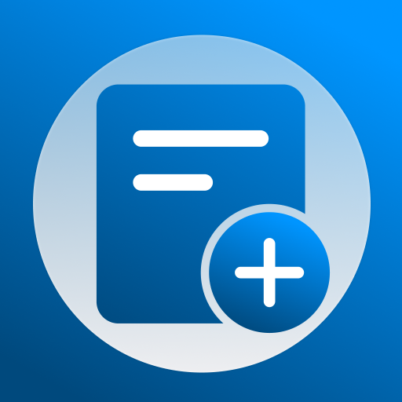
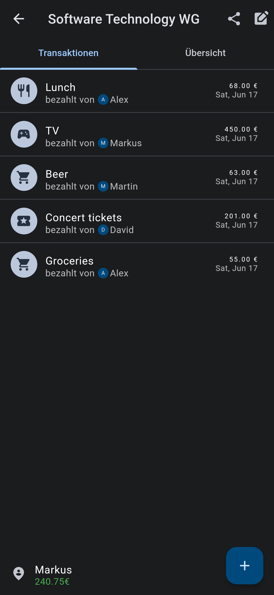

# Splitcount

> The easy way to share expenses!

With Splitcount you can create, manage and share transactions among multiple users in a group. Splitcount computes the saldo of each user and listes the individual expenses in a userfriendly way.

### Splitcount Features

- Multiple Groups can contain individual transactions for different users
- Data is persisted on Splitcounts servers
- Multi platform support: Splitcount supports Android, iOS, Windows, macOS and Web
- Multi language support: The application is available in English and German
- Dark and Light mode
- Transaction categories: Tag your transaction with a suiting category

